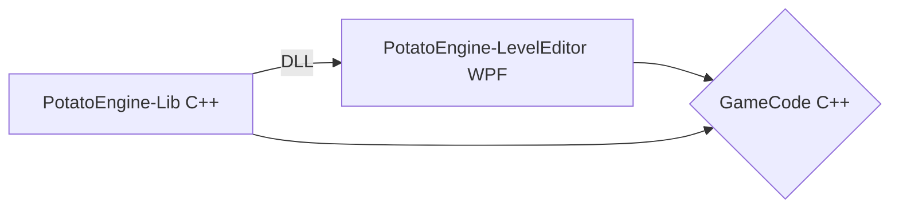
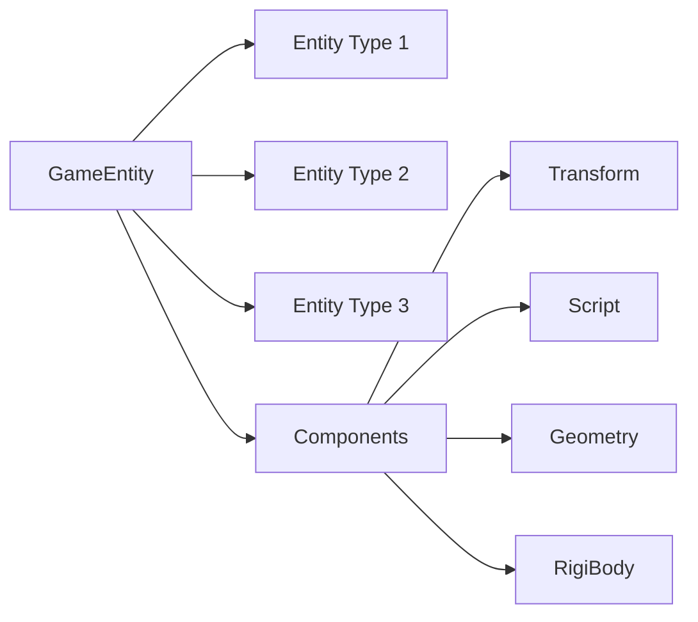
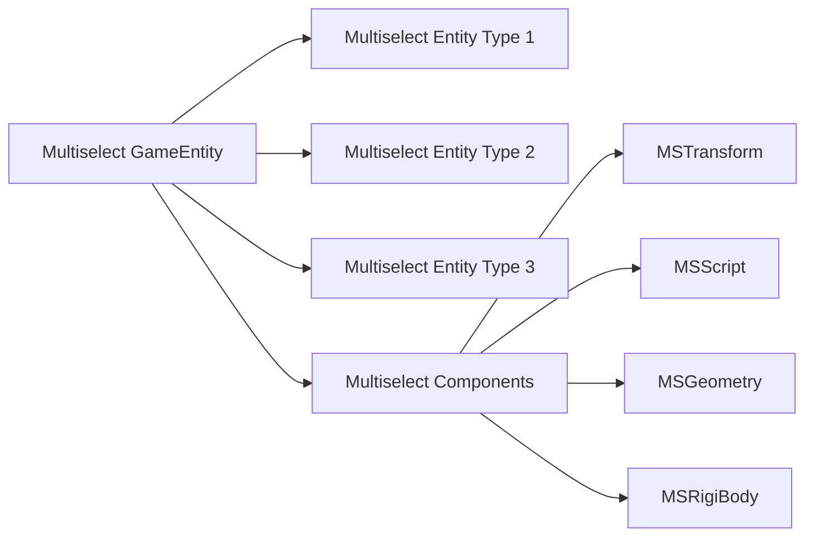

***
a low level C++ game engine
***
 

## Engine Structure

 

## Project Structure

**Project** - central data structure, contains everything. 
**Scenes** - Is a game level or a chunk of the world.
 

## GameEntity Structure

## Multiselect GameEntity Structure

## PotatoEngine-Lib (Data Oriented Design)
| Entity ids    | 001 | 002 | 003 | 004 | 005 | 006 | 007 | 008 | 009 | etc |
|---------------|-----|-----|-----|-----|-----|-----|-----|-----|-----|-----|
| Transform ids | 001 | 002 | 003 | 004 | 005 | 006 | 007 | 008 | 009 | etc |
| Script ids    | -1  | -1  | 001 | -1  | 002 | -1  | -1  | 003 | -1  | etc |
| Geometry ids  | 001 | 002 | -1  | 003 | 004 | 005 | 006 | -1  | -1  | etc |
| Rigibody ids  | -1  | -1  | -1  | 001 | 002 | -1  | 003 | -1  | -1  | etc |
