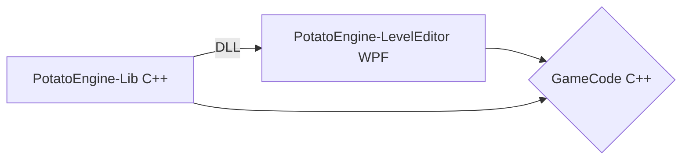
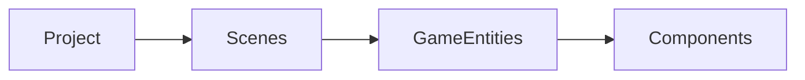

# PotatoEngine [alhpa-stage]
 **PotatoEngine** is a low level C++ game engine
 
 
## Engine Structure

 
## Project Structure

**Project** - central data structure, contains everything. 
**Scenes** - Is a game level or a chunk of the world.

