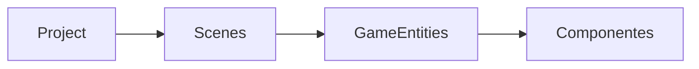

# PotatoEngine [alhpa-stage]
 **PotatoEngine** is a low level C++ game engine

## Engine Structure

## Project Structure

**Project** - central data structure, contains everything
**Scenes** - Is a game level or a chunk of the world

